# ShroudChronicle: The Dual-Lens Archive

**ShroudChronicle** is a Progressive Web Application (PWA) designed to visualize the history, science, and controversy surrounding the Shroud of Turin. 

Unlike traditional resources that often bias heavily toward either religious devotion or secular dismissal, this application implements a **"Dual-Lens" architecture**. This allows users to toggle the entire application state between a **"Believer" (Authenticity)** perspective and a **"Skeptic" (Medieval Artistry)** perspective, visualizing how the same raw data can lead to vastly different conclusions.

### 🔗 Live Demo: [https://cptnope.github.io/Shroud-Chronicle/](https://cptnope.github.io/Shroud-Chronicle/)


---

## 📊 Architecture & Logic Diagrams

### Application Component Structure


### Dual-Lens Data Flow


### PWA Lifecycle (Install & Update)

```mermaid
sequenceDiagram
    participant User
    participant Browser
    participant App
    participant SW as Service Worker
    participant Cache

    Note over User,Cache: 🔽 First Visit / Install Flow
    User->>Browser: Visit site
    Browser->>App: Load index.html
    App->>SW: Register sw.js
    SW->>Cache: Precache app shell + icons
    Browser->>App: Fire 'beforeinstallprompt'
    App->>User: Show InstallPrompt banner
    User->>Browser: Click "Install App"
    Browser->>User: App installed to device

    Note over User,Cache: 🔄 Update Flow
    User->>Browser: Return to app
    Browser->>SW: Check for new sw.js
    SW-->>Browser: New version found
    SW->>SW: Install new SW (waiting)
    Browser->>App: Fire 'updatefound'
    App->>User: Show UpdateNotification
    User->>App: Click "Refresh"
    App->>SW: postMessage('SKIP_WAITING')
    SW->>SW: Activate new version
    Browser->>User: Page reloads with update
```



### Service Worker Caching Strategy


### Data Model Relationships


---

## 🌟 Key Features

### 1. The Dual-Lens Engine
*   **Skeptic Mode**: Highlights historical gaps, carbon dating results, medieval artistic comparisons, and iconographic inconsistencies.
*   **Believer Mode**: Highlights forensic anomalies, pollen data, blood chemistry, and 3D image properties.

### 2. Interactive Artifact Viewer
*   **High-Res Analysis**: Zoomable interface for the Shroud image.
*   **Forensic Filters**:
    *   **Natural**: The sepia-tone appearance visible to the naked eye.
    *   **Negative**: Simulates the 1898 Secondo Pia photo-negative discovery.
    *   **3D Topography**: Simulates VP-8 Image Analyzer results (luminance-to-distance mapping).
    *   **UV Filter**: Visualizes fluorescence data distinguishing scorches from the body image.
*   **Contextual Hotspots**: Toggling the lens changes which anatomical details are highlighted (e.g., "Median Nerve/Missing Thumbs" vs "Gothic Art Style Fingers").

### 3. Data Visualization Vault
*   **Recharts Integration**: Interactive charts visualizing:
    *   Radiocarbon decay curves (Oxford vs. Rogers/Vanillin).
    *   WAXS (Wide-Angle X-ray Scattering) dating comparisons.
    *   Spectroscopy analysis (Blood vs. Iron Oxide Paint).
    *   Pollen distribution (Europe vs. Near East).

### 4. Viral Claim Fact-Checking
*   A searchable database of common internet myths (e.g., "NASA proved it's real," "Da Vinci painted it").
*   Verdicts categorized by: Verified, Plausible, Contested, or Debunked.

### 5. Progressive Web App (PWA)
*   **Offline First**: Uses a custom Service Worker (`sw.js`) to cache application shell and assets.
*   **Installable**: Manifest-compliant for installation on iOS (Safari Share -> Add to Home Screen) and Android.
*   **Auto-Update**: Detects new service worker versions and prompts the user to refresh.

## 🛠 Technical Architecture

This project is built using **React** and **TypeScript** without a complex build step. It utilizes modern ES Modules delivered via CDN (`esm.sh`) to run directly in the browser or via a simple static file server.

*   **Framework**: React 19
*   **Styling**: Tailwind CSS (via CDN)
*   **Icons**: Lucide React
*   **Charts**: Recharts
*   **State Management**: React Context / Local State
*   **Routing**: View-based state routing (Single Page Application)

## 🚀 Installation & Usage

Since this project uses ES Modules, it requires a local server to run (browsers block local file system imports due to CORS).

### Option 1: Node.js (npx)
```bash
npx serve
# Open http://localhost:3000
```

### Option 2: Python
```bash
python3 -m http.server 8000
# Open http://localhost:8000
```

### Option 3: VS Code
Install the "Live Server" extension and click "Go Live" in the bottom right corner.

## 📱 Mobile Installation

1.  **Deploy**: Host the files on any static host (GitHub Pages, Vercel, Netlify).
2.  **iOS**: Open in Safari, tap the "Share" button, scroll down, and tap "Add to Home Screen".
3.  **Android**: Open in Chrome, tap the menu (three dots), and tap "Install App".

## 📚 Data Sources & References

Data utilized in this application is aggregated from peer-reviewed papers and historical texts, including:

*   **Nature (1989)**: *Radiocarbon Dating of the Shroud of Turin*
*   **Thermochimica Acta (2005)**: *Rogers' Vanillin/Reweave Analysis*
*   **Heritage (2022)**: *De Caro et al. WAXS Dating*
*   **STURP Final Report (1981)**
*   **McCrone Research Institute Findings**

## 📝 Changelog

See [CHANGELOG.md](CHANGELOG.md) for a detailed history of changes and new features.

## 📄 License

This project is licensed under the MIT License - see the [LICENSE](LICENSE) file for details.
